# Pycharm professional edition

## Configure Pycharm to work with Docker

Open [microservice-name] folder in to your Pycharm professional edition

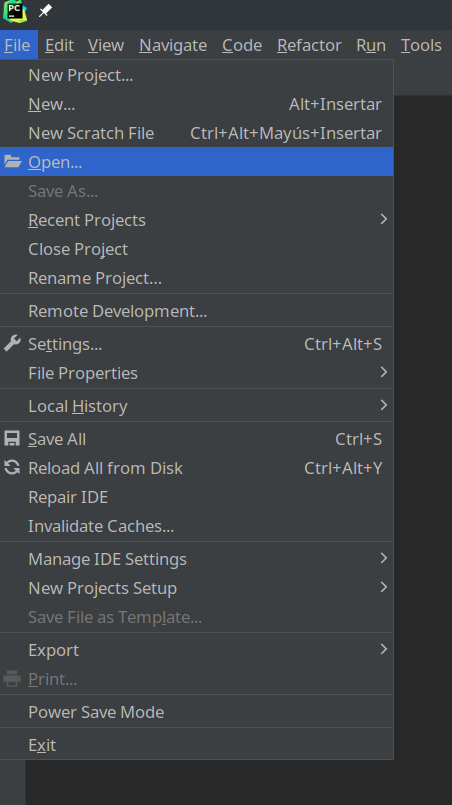

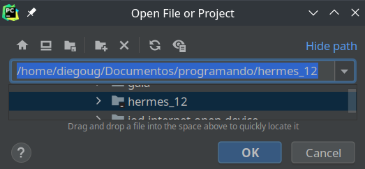

### Configure Pycharm professional edition

#### Configure Python interpreter

Open File > Settings, then on the settigs of pycharm select Project:[microservice-name] then select python interpreter, now add a new pthon interpreter, select the option On Docker Compose.

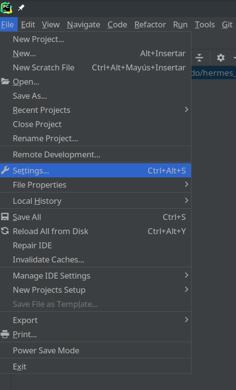

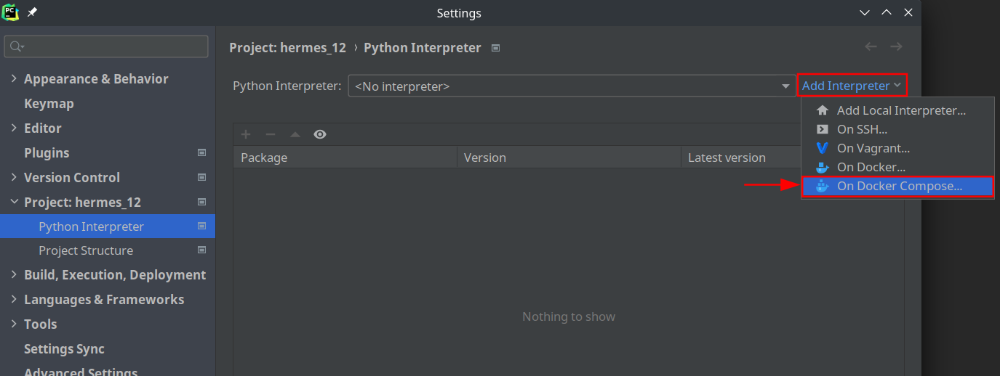

On the target Docker Compose select the folder on configuration files, add a new docker compose configuration file, find [docker-compose.yml](../docker/development/docker-compose.yml) file on hermes project.

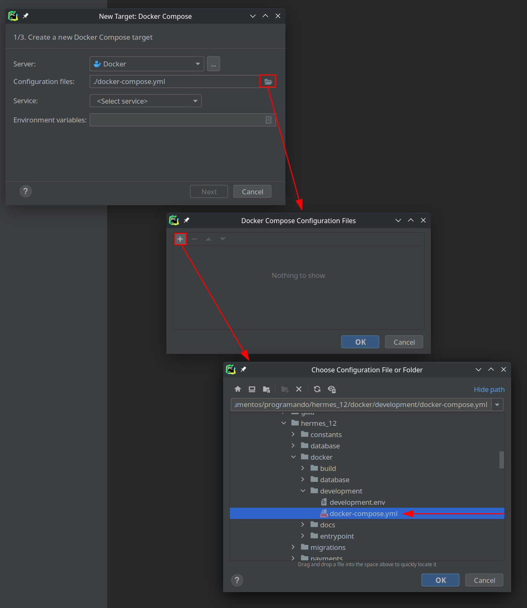

Add a enviroment variable LOCAL_VAR=/var to the target, then go Next.

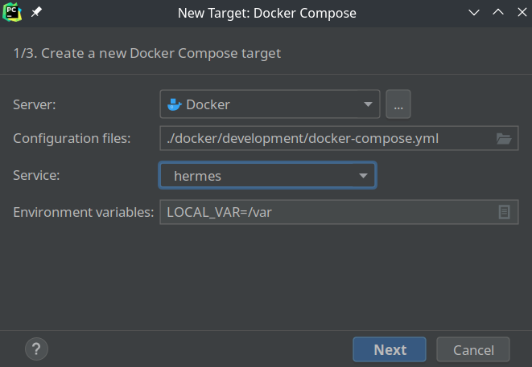

Now in the last step you can preview the created interpreter and then select Create

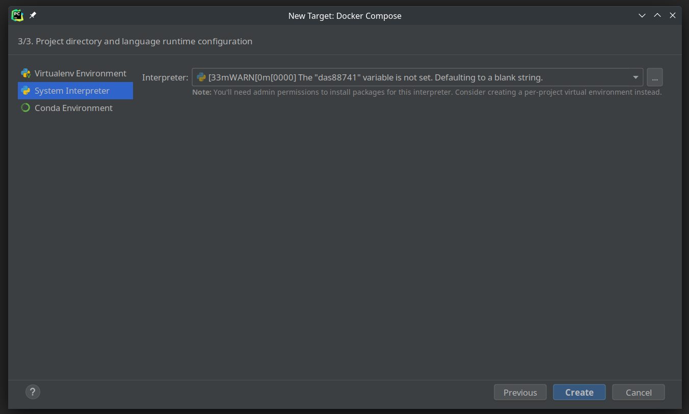

Now with this you can preview the correctly created python interpreter using docker compose, and now you can see the python libraries installed in this docker compose python interpreter

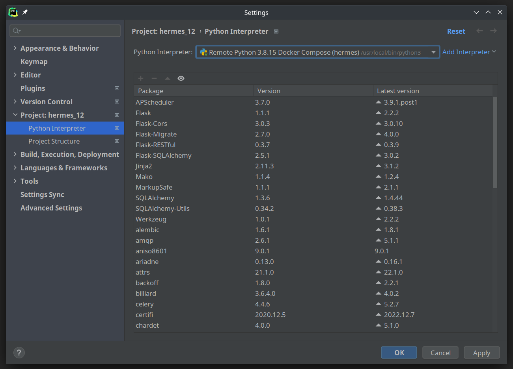

#### Configure Pycharm professional editio enviroment

In the upper right corner is the menu to configure the development environment which we are going to create using the previously configured interpreter.

select edit configurations, the Run/Debug Configurations window will open, in the plus symbol, you can add a new flask server, give it a name, preferably [microservice-name], in Target type select Scrit path, in additional options add the following configuration : --host=0.0.0.0 --port=3500, in python interpreter selects the interpreter that we created in the previous step, and to finish it is necessary to create some before launch actions

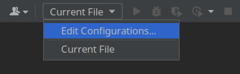

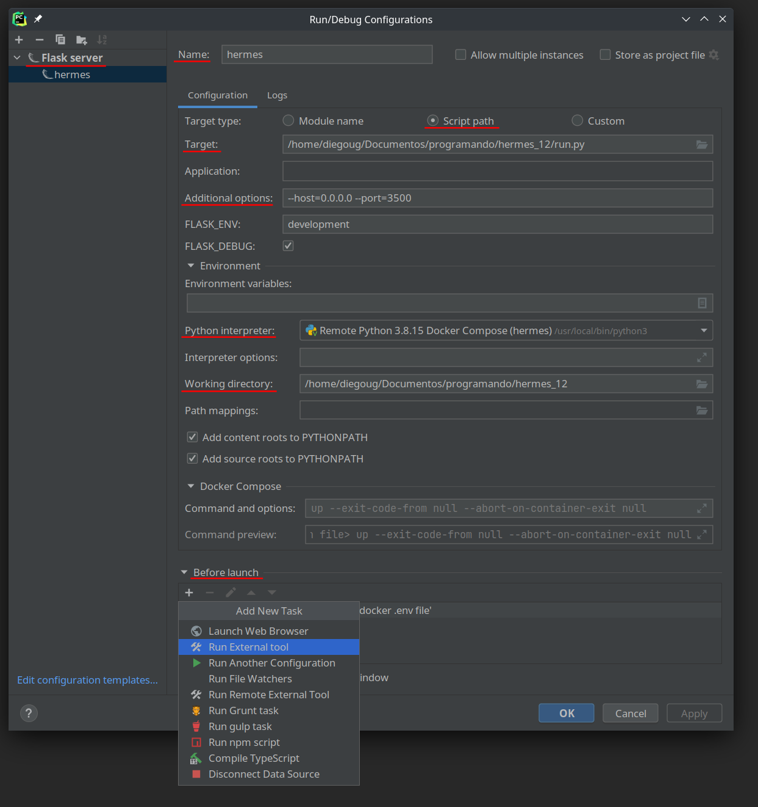

It is important to create a before launch action to create an environment variable file based on the environment variable file for development.

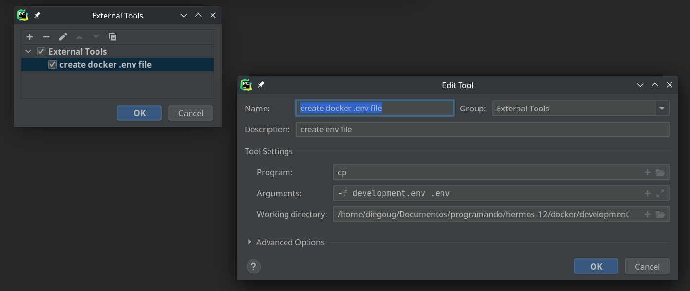

Once the before launch task is created, we return to the Run/Debug Configurations view and select ok

### Run debug mode

Now in the upper right corner will appear the created [microservice-name] environment and the debug and run options, if you select the bug you will be able to debug the application with break points, and if you select the play button you will be able to run the application, the difference is time boot and resources since debugging mode uses more of these to function.

### Running

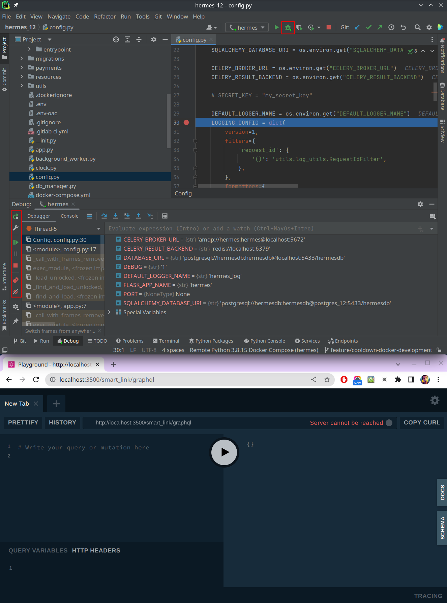

Back to [README](../../README.md)