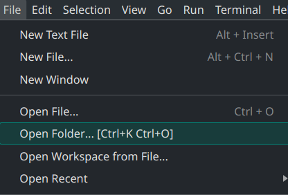
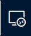
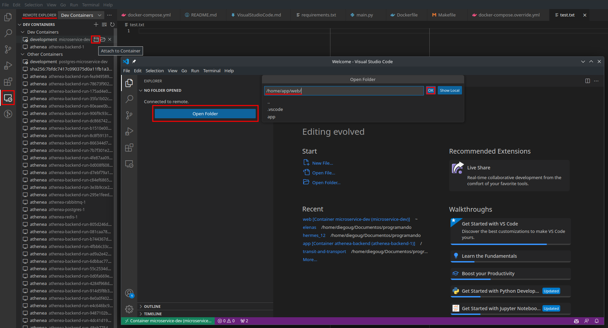
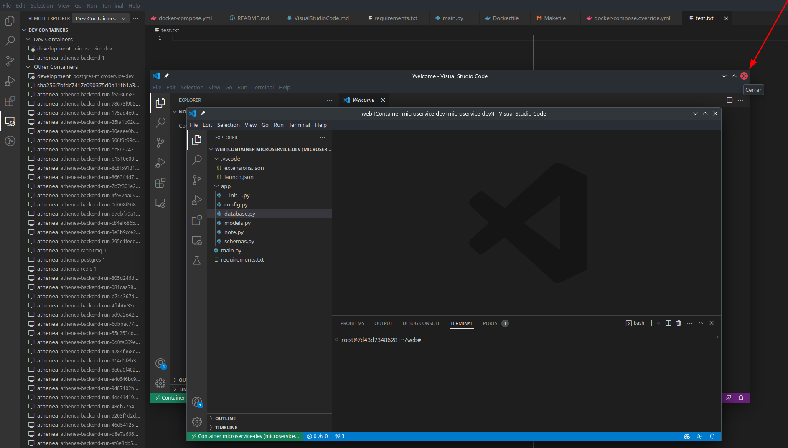
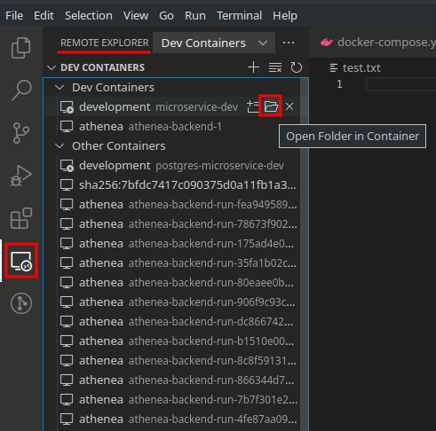
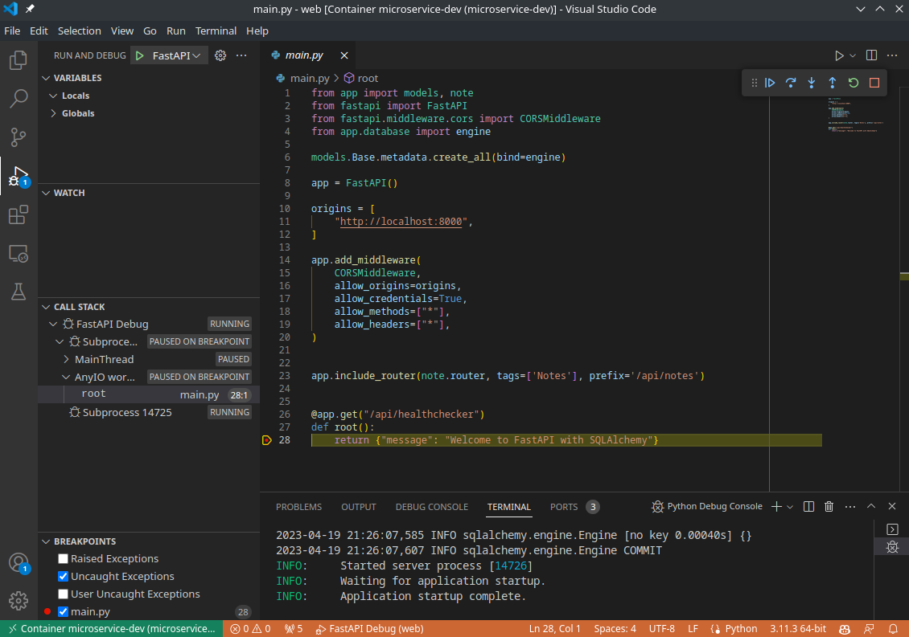
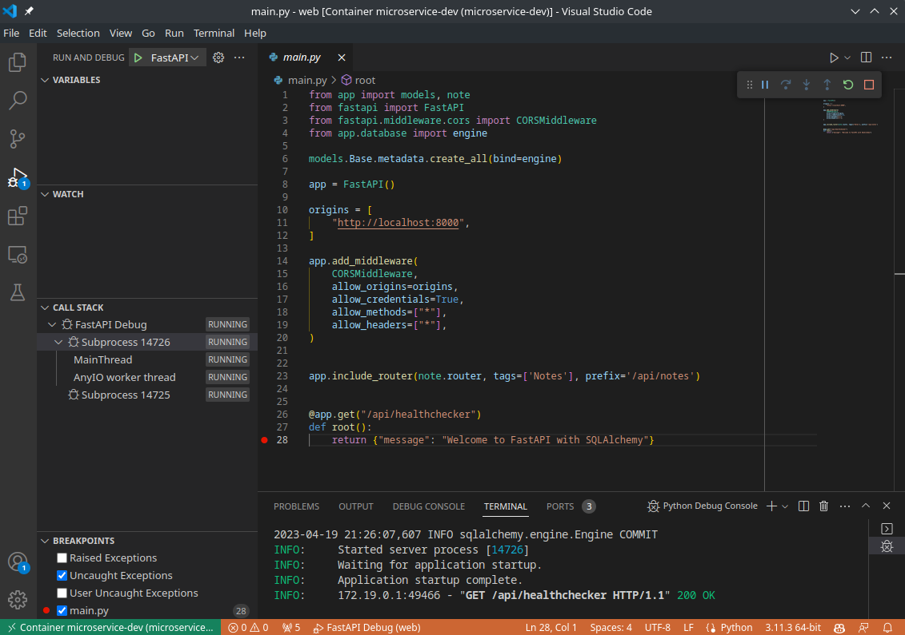

# Visual Studio Code

## Configure Visual Studio Code to work with Docker

Open [microservice-name] folder in to your Visual Studio Code project

### Configure Visual Studio Code

#### Running and Debuging containers with [Remote Explorer]

The plugin added called Remote Explorer allows to see what containers exist in the system and which are running (by a simple round mark in the screen). The icon can be found on the left side of the screen that looks like a remote conection icon.

https://marketplace.visualstudio.com/items?itemName=ms-vscode.remote-explorer

First 
yYou must run the containers with the instructions given in the [README](../../README.md) in the section "Commands to work with docker".

**NOTE:** If this is the first time that you run the container remotely in this vscode, we go to the Remote Explorer plugin and place the cursor on top of the name and an icon should show on the right side that looks like a window icon that is also "Attach Container" and from there a new window of Visual Studio Code should open and as soon as you enter it, a default route will be opened, then it will be necessary to open the application directory "/home/app/web/" another remote vscode will be opened that will point to the directory of the project as the home path, then you can close the previous window and from there on as soon as you open the container it will open in the directory you defined

### Run debug mode

Go to the Remote Explorer plugin and acess to the hermes container, click on "Open Folder in Container"

You must run the project being inside the container and no error should be given. To run the project can be done with Ctrl + Shift + D or going to the left side of Visual Studio Code window and find the Run button that looks like a play and a bug symbol and there also in the left side but on top, there should be a green play button that must be clicked and should run the project.

To debug the project must be running and in the line of code where you want to debug in the left side of the window where the code is shown click on the left side where the line number appears to make a red ball remain permanent, and there the code will stop if it pass by when is being used the project. Next an example of the to run the project and how is seen the red ball in the code lines:

### Running

Back to [README](../../README.md)